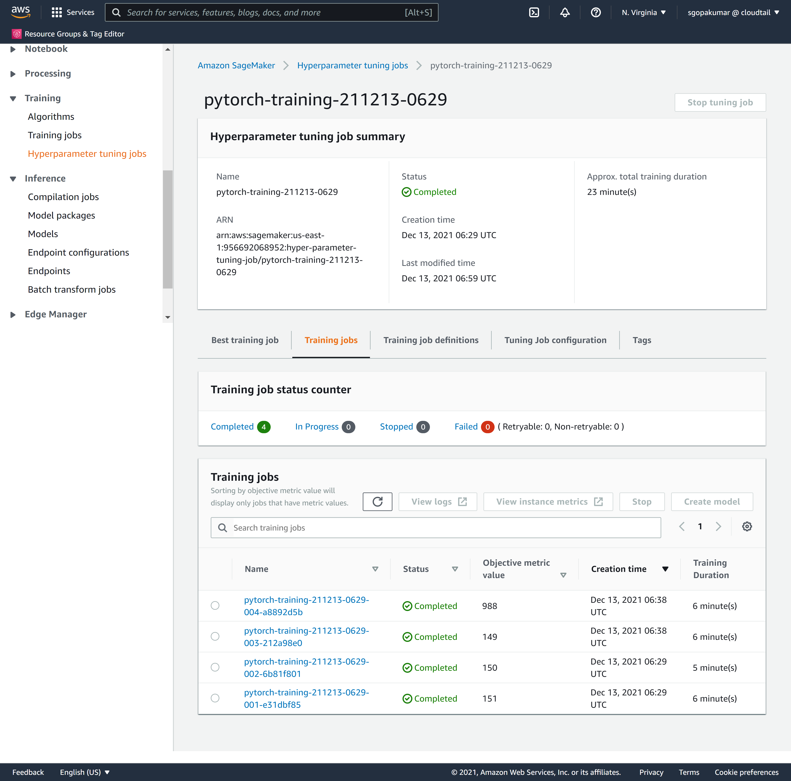
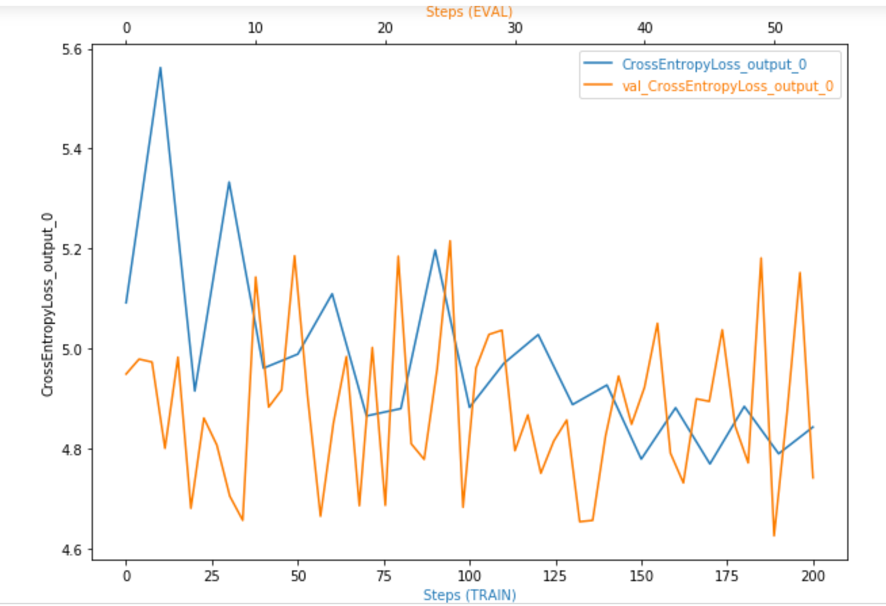
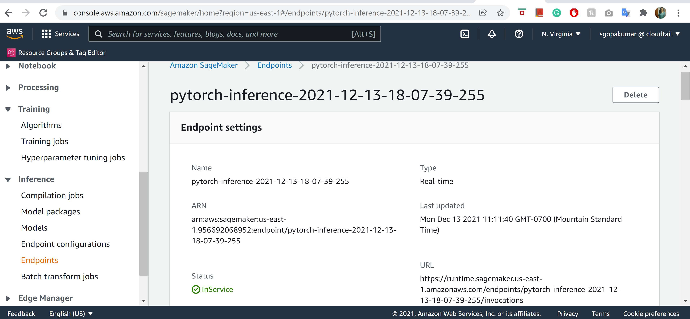
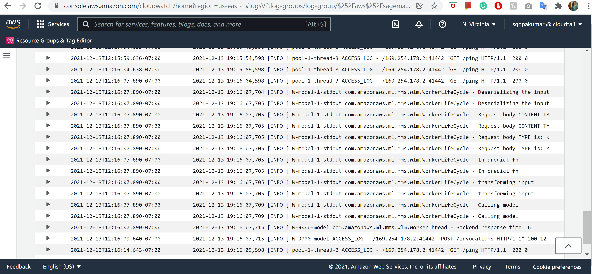

# Image Classification using AWS SageMaker

Use AWS Sagemaker to train a pretrained model that can perform image classification by using the Sagemaker profiling, debugger, hyperparameter tuning and other good ML engineering practices. This can be done on either the provided dog breed classication data set or one of your choice.

## Project Set Up and Installation
Enter AWS through the gateway in the course and open SageMaker Studio. 
Download the starter files.
Download/Make the dataset available. 

## Dataset
The provided dataset is the dogbreed classification dataset which can be found in the classroom.
The project is designed to be dataset independent so if there is a dataset that is more interesting or relevant to your work, you are welcome to use it to complete the project.
For this project used the Dog Breed dataset provided by Udacity

### Access
Upload the data to an S3 bucket through the AWS Gateway so that SageMaker has access to the data. Used aws s3 sync command 

## Entry point scripts
1. `hpo_vgg11.py`: Used to perform hyperparameter tuning job, using pretrained model VGG11. Hyperparameters chosen are `learning rate` and `batch size` from which the best model is chosen based on the loss metric after training.
2. `train_model_vgg11.py`: To train a model with the best hyperparameters got from the above hpo tuning process. Also added debugging and profiling hooks for easy debugging.
3. `endpoint_vgg11.py`: Used an entry point script for querying the endpoint and performing prediction from the trained model.

## Hyperparameter Tuning
For this project, the pretrained model opted was VGG11. The hyperparameters used are `learning rate` and `batch size`, learning rate being a continuous parameter and batch size being a categorical parameter. There were 2 parallel jobs with 4 maximum jobs. Upon performing hyperparameter tuning job, got the best hyperparameter combination as `learning rate=0.0015372117789691237`, and `batch size = 32`

Please find the below screen shot of fully completed hyperparameter tuning job

The best training job with reduced loss:
")

The worst training job with maximum loss:
")

## Debugging and Profiling
To record the Loss criterion(Cross Entropy Loss criterion), added the debugging hook to training, validation and testing phases

Please find below the plot of Cross Entropy Loss below:

It is evident from the plot that the line is not smooth but rather bumpy. Hence we can try to add more fully connected layers. 

### Results
After performing the hyperparameter tuning job in `ml.p3.2xlarge` instance, understood that it took so much time, hence used `ml.g4dn.xlarge` instance for this project.

Please find the Profiler report available in this folder "profiler-report.html"

## Model Deployment
While performing predictions from endpoint, got a model error. Hence used an inference script. Reference: https://sagemaker.readthedocs.io/en/stable/frameworks/pytorch/using_pytorch.html#load-a-model. The entry point script used is `endpoint_vgg11.py`. The same is available in this folder.

Please find the screen shot of active endpoint below:

## Instruction to query the endpoint
The user need to provide a test image of a dog to this endpoint and they will be able to get the predicted dog breed. 
The preprocessing/transformation process and loading the already trained model from `model_dir` path is taken care by `endpoint_vgg11.py` entry script.
Here is the code sample for querying an endpoint:

with open("./testdogImage.jpg", "rb") as f:
    
    payload = f.read()

This image saved locally is send to the endpoint using the code below:

predictor.predict(payload, initial_args={"ContentType": "image/jpeg"})

Please find below the CloudWatch Log of this active endpoint performing prediction:

